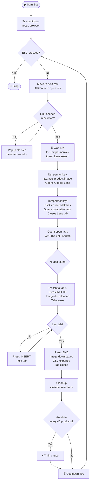

# 🤖 E-commerce Competitor Research Automation
### PyAutoGUI + Google Lens + Tampermonkey

> Fully automated desktop bot that reads product URLs from Google Sheets, triggers Google Lens reverse image search via Tampermonkey scripts, and harvests competitor product listings across major Brazilian marketplaces — exporting everything to structured CSV reports.


---

## 📋 Table of Contents

- [How It Works](#-how-it-works)
- [Flowchart](#-flowchart)
- [Prerequisites](#-prerequisites)
- [Installation](#-installation)
- [Tampermonkey Setup](#-tampermonkey-setup)
- [Running the Bot](#-running-the-bot)
- [Configuration](#%EF%B8%8F-configuration)
- [Controls](#-controls)
- [Output](#-output)

---

## ⚙️ How It Works

The bot orchestrates a multi-step browser automation pipeline entirely through desktop-level control (mouse/keyboard simulation), making it independent of any website's internal API:

1. **Reads** product URLs from Google Sheets (cursor must be on the first link cell)
2. **Opens** each product link in a new Chrome tab (`Alt+Enter`)
3. **Waits** for the Tampermonkey extension to extract the main product image and fire a Google Lens reverse search
4. **Waits** for a second Tampermonkey script to click "Exact Matches" in Lens and open competitor tabs (Amazon, Mercado Livre, Magazine Luiza, Americanas, Leroy Merlin, Casas Bahia)
5. **Counts** all open competitor tabs
6. **Processes** each tab sequentially:
   - Presses `INSERT` → Tampermonkey downloads the competitor's product image and closes the tab
   - Presses `END` on the last tab → Downloads image + exports a consolidated CSV report
7. **Cleans up** any leftover tabs and applies an anti-ban cooldown
8. **Loops** to the next product automatically

---

## 🔀 Flowchart



---

## 🛠️ Prerequisites

| Requirement | Details |
|---|---|
| **OS** | Windows 10/11 |
| **Browser** | Google Chrome (latest) |
| **Python** | 3.8 or higher |
| **Tampermonkey** | Chrome extension installed |
| **Google Sheets** | Spreadsheet with product URLs in a column |

---

## 📦 Installation

### 1. Clone the repository

```bash
git clone https://github.com/Gabrielbenin/WebScraperPyautogui.git
cd WebScraperPyautogui
```

### 2. Install Python dependencies

```bash
pip install pyautogui keyboard pygetwindow
```

Or run the included launcher:

```bash
iniciar.bat
```

---

## 🐒 Tampermonkey Setup

This bot depends on **4 Tampermonkey scripts** that must be installed in Chrome. Import them in this order:

### Script 1 — Product Image Extractor + Google Lens Trigger
**File:** `Product Scraper - Auto Google Lens (Image Focused).user.js`

> Runs on the product page. Extracts the main product image using multiple CSS selector strategies (with fallback to `og:image` metadata), copies the URL to clipboard, and opens Google Lens in a new tab.

**To install:**
1. Click the Tampermonkey icon → `Create new script`
2. Paste the contents of `Product Scraper - Auto Google Lens (Image Focused).user.js`
3. Save (`Ctrl+S`)

---

### Script 2 — Google Lens Automation (Click Exact Matches + Open Competitors)
**File:** `Automação Google Lens V5.5 (Busca Concorrentes BR - Auto Fechar).user.js`

> Runs on `lens.google.com`. Automatically clicks the "Exact Matches" tab, collects up to 12 competitor links from target marketplaces, opens each in a background tab, then closes the Lens tab automatically.

**Target marketplaces:** Mercado Livre, Casas Bahia, Leroy Merlin, Americanas, Amazon BR, Magazine Luiza

---

### Script 3 — Global Download Queue + CSV Exporter
**File:** `Fila Global - Download Sincronizado e Infalível (Lojas).user.js`

> Runs on all marketplace pages. Injects a floating panel with two buttons:
> - **INSERT** → Downloads the competitor's product image via Blob (bypasses CORS) and registers it in a global queue
> - **END** → Downloads the last image + generates a consolidated CSV with all URLs, image paths, and product IDs, then closes the tab

---

### Script 4 — Out-of-Stock / Own-Brand Tab Closer
**File:** `Marketplaces - Matador Definitivo (V11.0 - Blindagem Total).user.js`

> Runs on all marketplace pages. Uses a MutationObserver to detect out-of-stock messages or own-brand seller listings and closes those tabs immediately, keeping only valid competitor results.

---

## ▶️ Running the Bot

### Step-by-step

1. **Open Chrome** and navigate to your Google Sheets spreadsheet
2. **Click on the first product URL cell** in your list
3. Make sure all **4 Tampermonkey scripts are enabled**
4. Open a terminal in the project folder and run:

```bash
python automacao.py
```

5. You have **5 seconds** to click back on the Chrome window before the bot starts
6. The bot will process products one by one until it reaches an empty cell or you press `ESC`

---

## ⚙️ Configuration

Edit these constants at the top of `automacao.py` to tune the bot's behavior:

```python
WAIT_EXTENSIONS    = 48   # Seconds to wait for Tampermonkey + Lens to complete
WAIT_AFTER_KEY     = 4    # Seconds after pressing INSERT/END for download to finish
WAIT_BETWEEN_PRODUCTS = 40 # Cooldown between products (anti-ban)
COUNTDOWN          = 5    # Seconds before bot starts (time to focus browser)
POPUP_RETRY_MAX    = 3    # Max retries when popup blocker is detected
```

> ⚠️ If your internet is slow, increase `WAIT_EXTENSIONS`. If images fail to download, increase `WAIT_AFTER_KEY`.

---

## 🎮 Controls

| Key | Action |
|---|---|
| `ESC` | Stop the automation immediately (safe stop) |
| Mouse corner (top-left) | PyAutoGUI fail-safe — also stops the bot |

---

## 📁 Output

The bot generates files in an `AbasSalvas/` folder (created automatically by Tampermonkey):

```
AbasSalvas/
├── IMG_1234567890_001.jpg    ← competitor product images
├── IMG_1234567890_002.webp
├── 9988776.csv               ← CSV report for product ID 9988776
└── 9988775.csv
```

### CSV Format

```
Page URL ; Image URL ; Saved File Name ; Product ID
https://amazon.com.br/... ; https://cdn.../img.jpg ; IMG_xxx.jpg ; 9988776
https://mercadolivre.com.br/... ; https://... ; IMG_xxx.jpg ; 9988776
```

---

## 📄 License

MIT — free to use, modify and distribute.
